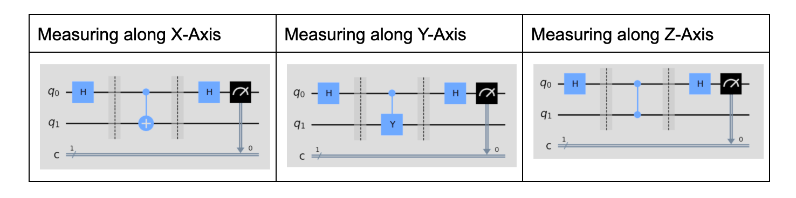
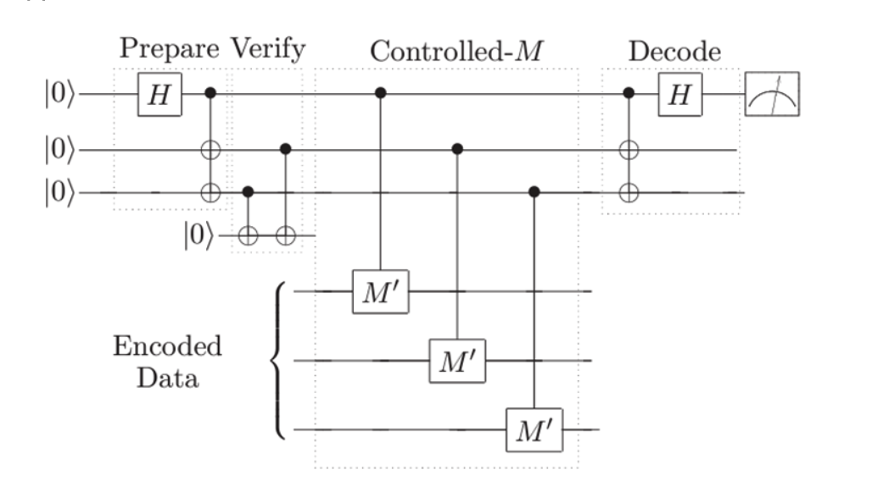

# Lab 11: Fault-Tolerance

Submit to Gradescope and Autograder by 11:55 pm Thu 4/16

[Starter Code](https://eecs479.github.io/lab-11/starter_code.zip)

[Qiskit Tutorials](https://docs.quantum.ibm.com/)

## Measurement

For the third (and final) time, we are looking at another way to estimate coordinates on the Bloch sphere. This time, we consider a logical qubit encoded over 3 physical qubits using the 3-qubit bit-flip code, and we assume an arbitrary qubit error may occur during our measurement procedure.

Below are the circuits used in lab 3 to measure the \(X\), \(Y\), and \(Z\) axis of a qubit.

These circuits are not fault-tolerant, because a single error on \(q_1\) could multiply to several physical qubits in \(q_0\), rendering error-correction ineffective. The following is a fault-tolerant approach.

1. Prepare the circuit in the special cat state \(\lvert 000\rangle + \lvert 111\rangle\) (a multi-qubit generalization of the Bell state).

2. Since an error may occur here and spread to our encoded data later, verify preparation by performing 3 parity checks (only one is shown in the handout) between every pair of cat qubits. If any of these measure \(1\), start over at step 1. The `while_loop` method will be helpful here.

3. Once all parity checks pass and we are confident the cat state is prepared, apply the appropriate controlled gate transversally across each encoded data bit, ensuring each cat qubit is used only once to prevent new errors from multiplying.
   - \(X\) and \(Z\) gates work as expected, since they have eigenvalues \(+1\) and \(-1\). Because \(1^3 = 1\) and \((-1)^3 = -1\), applying 3 controlled gates preserves the expected sign.
   - For \(Y\), eigenvalues are \(i\) and \(-i\), and \(i^3 = -i\), \((-i)^3 = i\), so the result is off by a phase of \(-1\). As discussed previously, correct this phase with an additional gate sequence, i.e. \(M' = Y * [\text{additional gates to add } -1 \text{ global phase}]\).

4. Decode the cat qubits and measure the least significant qubit. The more often you measure a \(0\), the closer the state is to a \(+1\) eigenstate of the axis in question. The more often you measure a \(1\), the closer it is to a \(-1\) eigenstate.

5. Since an error could have occurred after parity checks in step 2, repeat this whole process (starting from step 1) 2 more times (3 total iterations). In each iteration, step 4 must write to a different classical register. Then take a majority vote over the three outcomes. Assuming at most one error has occurred, majority vote should identify the correct value.

## Autograder Portion

You are to fill in implementations for:

- `prepare_ancilla`
- `FT_meas_X`
- `FT_meas_Y`
- `FT_meas_Z`
- `process_counts`

`decode_and_measure` is already completed.

Your code will be run on the same tests as labs 2 and 3, plus additional tests that insert a random bug somewhere on the ancilla bits. Handling general errors on data qubits would require adding a phase-flip code (i.e. constructing the Shor code), so those errors are ignored for simplicity in this lab.

There are also tests for `prepare_ancilla` and `process_counts`.

**Useful Qiskit methods:** `while_loop`
